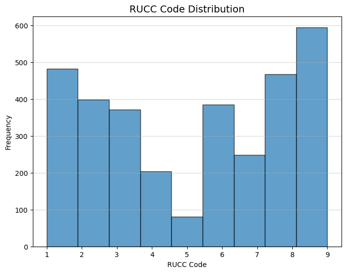
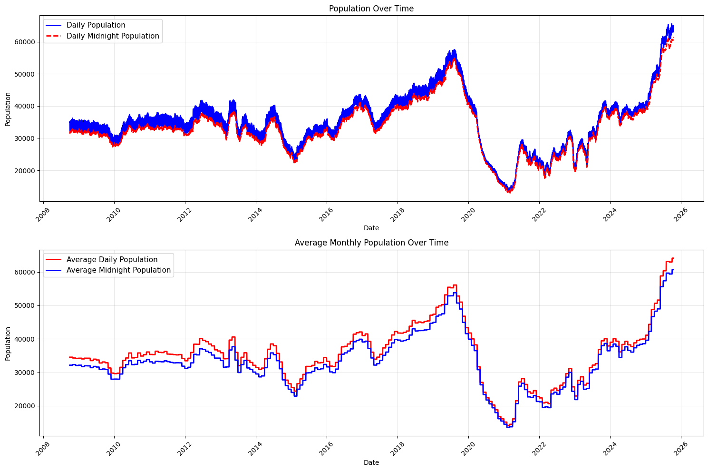
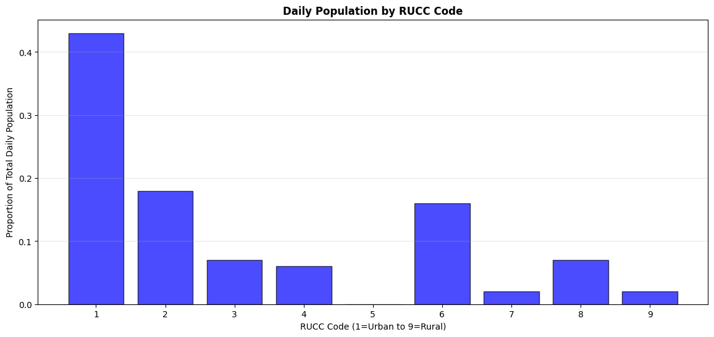

# Rural Detention Centers (Early) Analysis

- The dataset is well constructed but a lot of the statistics and plots from this are mostly exploratory just for us to get a feel for some of the trends in the data.

- There's no spatial analysis, the stuff in here is mostly to give us a feel for what the detention data looks like.
	- The Vera Institute data included point data for the locations in addition to the county shape data available through the ACS. I've never worked with point data but I'm sure Matt knows a bunch of interesting stuff that could be done with it.
	- The ACS provides county level geographic data like the census tract data I used in my thesis, I think there's a lot of potential having both point and shape data

## RUCC Codes

***Note: The Rural-Urban Continuum Codes are just county-level RUCA Codes***

- There's nothing stopping us from changing to the RUCA codes and using census tracts instead of counties. it made more sense to me at least as a starting point since in less populated areas (in my experience) a lot of criminal justice stuff works more at the county level for this kind of stuff. Let me know your thoughts on that.

### Code Descriptions

|Code|Description|Category|
|---|---|---|
|1|Counties in metro areas of 1 million population or more|Metropolitan|
|2|Counties in metro areas of 250,000 to 1 million population|Metropolitan|
|3|Counties in metro areas of fewer than 250,000 population|Metropolitan|
|4|Urban population of 20,000 or more, adjacent to a metro area|Nonmetropolitan|
|5|Urban population of 20,000 or more, not adjacent to a metro area|Nonmetropolitan|
|6|Urban population of 5,000 to 20,000, adjacent to a metro area|Nonmetropolitan|
|7|Urban population of 5,000 to 20,000, not adjacent to a metro area|Nonmetropolitan|
|8|Urban population of fewer than 5,000, adjacent to a metro area|Nonmetropolitan|
|9|Urban population of fewer than 5,000, not adjacent to a metro area|Nonmetropolitan|

This is what the RUCC data looks like:

<table border="1" class="dataframe">
  <thead>
	<tr style="text-align: right;">
	  <th></th>
	  <th>FIPS</th>
	  <th>state</th>
	  <th>county</th>
	  <th>RUCC</th>
	</tr>
  </thead>
  <tbody>
	<tr>
	  <th>0</th>
	  <td>1001</td>
	  <td>AL</td>
	  <td>Autauga</td>
	  <td>2.0</td>
	</tr>
	<tr>
	  <th>1</th>
	  <td>1003</td>
	  <td>AL</td>
	  <td>Baldwin</td>
	  <td>3.0</td>
	</tr>
	<tr>
	  <th>2</th>
	  <td>1005</td>
	  <td>AL</td>
	  <td>Barbour</td>
	  <td>6.0</td>
	</tr>
	<tr>
	  <th>3</th>
	  <td>1007</td>
	  <td>AL</td>
	  <td>Bibb</td>
	  <td>1.0</td>
	</tr>
	<tr>
	  <th>4</th>
	  <td>1009</td>
	  <td>AL</td>
	  <td>Blount</td>
	  <td>1.0</td>
	</tr>
  </tbody>
</table>

### RUCC Code Distributions

- The distinctions for the RUCC codes are different (metropolitan & nonmetropolitan vs metropolitan, micropolitan, small town, & rural). I don't think I have anything definitive to say about that at the moment but if we stick with the RUCC codes, something might need to be done to differentiate nonmetropolitan and rural.
	- One possible option would be to calculate the most frequent RUCA code for the census tracts in each county which would make it reasonable to say if a county is 'mostly rural' or 'mostly micropolitan'

## Detention Data

### Overview

From the [Vera dataset Github](https://github.com/vera-institute/ice-detention-trends/tree/main#about-the-data)

> Vera's ICE Detention Trends dashboard reveals an unprecedented level of detail about ICE detention populations — nationally and across the 1,464 facilities in which ICE detained people — on each day of the 16-year period from fiscal year 2009 through the beginning of fiscal year 2026 (October 1, 2008, through October 15, 2025). This repository includes the aggregated data visualized in the dashboard, including information on:
>
> - Midnight population: the daily number of people detained at midnight (nationally and by facility).
> - 24-hour population: the number of people detained for any part of a given day, including those whom ICE transferred or booked-out of custody before midnight (nationally and by facility). While ICE relies solely on midnight populations in its reporting, Vera includes both types of daily populations — midnight and 24-hour — as the two can differ drastically.
> - Book-ins: the daily number of people ICE booked into custody (nationally).
> - Book-outs: the daily number of people ICE booked out of custody (nationally).
> - Facility names, locations, and types (as coded by ICE in other datasets, where available).
> 
> The original datasets included facility names and codes, but no information on location or facility type. Vera drew from additional datasets and public sources to geocode facility > locations and assign facility types. Given the lack of a comprehensive, up-to-date ICE source to assign facility types to all 1,464 facility codes in the dataset, Vera's categorizations should be interpreted as best-known facility type. To simplify map filtering options, Vera grouped facility types assigned by ICE, as well as ones manually entered by Vera, into the following categories:
>
> - Non-Dedicated: IGSA (Inter-governmental Service Agreement).
> - Dedicated: DIGSA (Dedicated IGSA), SPC (Service Processing Center), CDF (Contract Detention Facility).
> - Federal: USMS IGA (U.S. Marshals Service Inter-governmental Agreement), BOP (Bureau of Prisons), USMS CDF (U.S. Marshals Service Contract Detention Facility), DOD (Department of Defense), MOC (Migrant Operations Center). Because ICE can be added to other federal agencies' facility contracts or agreements through a "rider," Vera reports federal facilities as a separate category, rather than grouped with other categories such as non-dedicated facilities.
> - Hold/Staging.
> - Family/Youth: Family, Family Staging, Juvenile. ICE's use of the "Juvenile" facility type reflects ICE detention and does not refer to facilities used to detain unaccompanied children in the custody of the Office of Refugee Resettlement (ORR).
> - Medical: Facilities coded by ICE as "Hospital" and medical or mental health facilities manually coded by Vera.
> - Hotel: Facilities coded by ICE as "Hotel" and facilities manually coded by Vera.
> - Other/Unknown: Facilities coded by ICE as "Other" or ones for which Vera was unable to assign facility type.

### Facilities

#### Variables

> The ICE detention datasets include facility names and codes, but no information on location or facility type. Vera drew from additional datasets and public sources to geocode facility locations and assign facility types. Given the lack of a comprehensive, up-to-date ICE source to assign facility types to all facility codes in the dataset, Vera's categorizations should be interpreted as best-known facility type.

|Variable|Type|Description|
|---|---|---|
|detention_facility_code|`string`|The unique identifier used in the ICE detention data for each facility|
|detention_facility_name|`string`|The facility name associated with the detention_facility_code in the ICE detention data|
|latitude|`numeric`|The latitude coordinate of the facility location|
|longitude|`numeric`|The longitude coordinate of the facility location|
|address|`string`|The best known facility address|
|city|`string`|The city in which the facility is located|
|county|`string`|The county in which the facility is located|
|state|`string`|The state abbreviation code. This also includes codes for U.S. territories (e.g. "PR" for "Puerto Rico") and Cuba ("CU") for facilities at Naval Station Guantanamo Bay.|
|aor|`aor`|The ICE Area of Responsibility (AOR), originally mapped by Will Craft of the Guardian US. This reflects county boundaries extracted from ICE's [field office map](https://www.ice.gov/doclib/about/offices/ero/pdf/eroFieldOffices.pdf), last updated by ICE in February 2024.|

### State Data

Facility-level population statistics for each day between October 1, 2008, and October 15, 2025, including midnight population and 24-hour population.

|Variable|Type|Description|
|---|---|---|
|detention_facility_code|`string`|The unique identifier used in the ICE detention data for each facility|
|detention_facility_name|`string`|The facility name associated with the detention_facility_code in the ICE detention data|
|state|`string`|The state abbreviation code. This also includes codes for U.S. territories (e.g. "PR" for "Puerto Rico") and Cuba ("CU") for facilities at Naval Station Guantanamo Bay.|
|date|`date`|The day each count is reported for (`yyyy-mm-dd` format)|
|daily_pop|`numeric`|24-hour population: the number of people detained for any part of a given day, including those whom ICE transferred or booked-out of custody before midnight|
|midnight_pop|`numeric`|Midnight population: the daily number of people detained at midnight|

## Data Processing

This first table shows the structure of the data once the facilities data is merged with the daily data.

<table border="1" class="dataframe">
  <thead>
	<tr style="text-align: right;">
	  <th></th>
	  <th>detention_facility_code</th>
	  <th>detention_facility_name</th>
	  <th>state</th>
	  <th>date</th>
	  <th>daily_pop</th>
	  <th>midnight_pop</th>
	  <th>county</th>
	  <th>aor</th>
	  <th>latitude</th>
	  <th>longitude</th>
	  <th>type_detailed</th>
	  <th>type_grouped</th>
	  <th>year</th>
	  <th>daily_change</th>
	  <th>GEOID</th>
	  <th>RUCC</th>
	</tr>
  </thead>
  <tbody>
	<tr>
	  <th>0</th>
	  <td>NYEPANV</td>
	  <td>Nye County Sheriff-Pahrump</td>
	  <td>NV</td>
	  <td>2008-10-01</td>
	  <td>0.0</td>
	  <td>0.0</td>
	  <td>Nye</td>
	  <td>Salt Lake City</td>
	  <td>36.219543</td>
	  <td>-115.982801</td>
	  <td>IGSA</td>
	  <td>Non-Dedicated</td>
	  <td>2008</td>
	  <td>0.0</td>
	  <td>32023.0</td>
	  <td>4.0</td>
	</tr>
	<tr>
	  <th>1</th>
	  <td>NYEPANV</td>
	  <td>Nye County Sheriff-Pahrump</td>
	  <td>NV</td>
	  <td>2008-10-02</td>
	  <td>0.0</td>
	  <td>0.0</td>
	  <td>Nye</td>
	  <td>Salt Lake City</td>
	  <td>36.219543</td>
	  <td>-115.982801</td>
	  <td>IGSA</td>
	  <td>Non-Dedicated</td>
	  <td>2008</td>
	  <td>0.0</td>
	  <td>32023.0</td>
	  <td>4.0</td>
	</tr>
	<tr>
	  <th>2</th>
	  <td>NYEPANV</td>
	  <td>Nye County Sheriff-Pahrump</td>
	  <td>NV</td>
	  <td>2008-10-03</td>
	  <td>0.0</td>
	  <td>0.0</td>
	  <td>Nye</td>
	  <td>Salt Lake City</td>
	  <td>36.219543</td>
	  <td>-115.982801</td>
	  <td>IGSA</td>
	  <td>Non-Dedicated</td>
	  <td>2008</td>
	  <td>0.0</td>
	  <td>32023.0</td>
	  <td>4.0</td>
	</tr>
	<tr>
	  <th>3</th>
	  <td>NYEPANV</td>
	  <td>Nye County Sheriff-Pahrump</td>
	  <td>NV</td>
	  <td>2008-10-04</td>
	  <td>0.0</td>
	  <td>0.0</td>
	  <td>Nye</td>
	  <td>Salt Lake City</td>
	  <td>36.219543</td>
	  <td>-115.982801</td>
	  <td>IGSA</td>
	  <td>Non-Dedicated</td>
	  <td>2008</td>
	  <td>0.0</td>
	  <td>32023.0</td>
	  <td>4.0</td>
	</tr>
	<tr>
	  <th>4</th>
	  <td>NYEPANV</td>
	  <td>Nye County Sheriff-Pahrump</td>
	  <td>NV</td>
	  <td>2008-10-05</td>
	  <td>0.0</td>
	  <td>0.0</td>
	  <td>Nye</td>
	  <td>Salt Lake City</td>
	  <td>36.219543</td>
	  <td>-115.982801</td>
	  <td>IGSA</td>
	  <td>Non-Dedicated</td>
	  <td>2008</td>
	  <td>0.0</td>
	  <td>32023.0</td>
	  <td>4.0</td>
	</tr>
  </tbody>
</table>

Total Observations: 8875424,
 Missing states: 0,
 Missing counties: 24896,
 Missing RUCC codes: 634848
----------------------
Columns: detention_facility_code, detention_facility_name, state, date, daily_pop, midnight_pop, county, aor, latitude, longitude, type_detailed, type_grouped, year, daily_change, GEOID, RUCC

I'm not totally sure why there's 630,000 observations with missing RUCC codes. I played around with it for a long time and couldn't get the number to go down. Definitely a question for Matt because he knows a lot about set theory. The only thing that effects is the RUCC averages at the very bottom.

---

### Cumulative Change Over Time

Descriptive Stats: Daily
68% of data between: 26500.9 and 44316.5
95% of data between: 17593.1 and 53224.3
99.7% of data between: 8685.3 and 62132.1

<table border="1" class="dataframe">
  <thead>
	<tr style="text-align: right;">
	  <th></th>
	  <th>daily_pop</th>
	  <th>midnight_pop</th>
	  <th>daily_change</th>
	</tr>
  </thead>
  <tbody>
	<tr>
	  <th>count</th>
	  <td>6224.00</td>
	  <td>6224.00</td>
	  <td>6224.00</td>
	</tr>
	<tr>
	  <th>mean</th>
	  <td>35408.69</td>
	  <td>33429.30</td>
	  <td>1979.39</td>
	</tr>
	<tr>
	  <th>std</th>
	  <td>8907.79</td>
	  <td>8423.86</td>
	  <td>1187.01</td>
	</tr>
	<tr>
	  <th>min</th>
	  <td>13353.00</td>
	  <td>12969.00</td>
	  <td>47.00</td>
	</tr>
	<tr>
	  <th>25%</th>
	  <td>30896.00</td>
	  <td>29411.00</td>
	  <td>782.00</td>
	</tr>
	<tr>
	  <th>50%</th>
	  <td>35212.00</td>
	  <td>32824.00</td>
	  <td>2111.00</td>
	</tr>
	<tr>
	  <th>75%</th>
	  <td>39736.75</td>
	  <td>37581.50</td>
	  <td>3007.00</td>
	</tr>
	<tr>
	  <th>max</th>
	  <td>65533.00</td>
	  <td>61274.00</td>
	  <td>5001.00</td>
	</tr>
  </tbody>
</table>

Initial Observations on the descriptive statistics:
- The narrow distance between the average daily population and the average midnight population as well as the moderate standard deviation indicates that there is high turnover with consistent occupancy levels over the whole period of the dataset
	- The limitation to this observation is, as the time series plots below show, there are a lot of peaks and valleys to the data. The size of the sample size (6224 records/days)
- The plots below show a huge decline starting in late 2019 and hitting the overall low in mid-late 2021.
	- Presumably this is due to various measures put in place because of COVID-19, assuming measures were taken regarding immigrant detention as with like traditional state prisons.
- Every 2/3 days there were between 26,501 and 44,317 people incarcerated in the system.

I don't remember how to do it but I'll try to find how the correct way to overlay the average daily population line over the daily population line, but I think these visualizations do a good job at reflecting the high level of variation day-to-day compared to the overall long-term increases.

---

### Detention Levels On the Rural-Urban Continuum

Averages per RUCC code

<table border="1" class="dataframe">
  <thead>
	<tr style="text-align: right;">
	  <th></th>
	  <th>RUCC</th>
	  <th>daily_pop</th>
	  <th>midnight_pop</th>
	  <th>daily_change</th>
	</tr>
  </thead>
  <tbody>
	<tr>
	  <th>0</th>
	  <td>1.0</td>
	  <td>0.43</td>
	  <td>0.42</td>
	  <td>0.50</td>
	</tr>
	<tr>
	  <th>1</th>
	  <td>2.0</td>
	  <td>0.18</td>
	  <td>0.18</td>
	  <td>0.22</td>
	</tr>
	<tr>
	  <th>2</th>
	  <td>3.0</td>
	  <td>0.07</td>
	  <td>0.07</td>
	  <td>0.08</td>
	</tr>
	<tr>
	  <th>3</th>
	  <td>4.0</td>
	  <td>0.06</td>
	  <td>0.06</td>
	  <td>0.04</td>
	</tr>
	<tr>
	  <th>4</th>
	  <td>5.0</td>
	  <td>0.00</td>
	  <td>0.00</td>
	  <td>0.01</td>
	</tr>
	<tr>
	  <th>5</th>
	  <td>6.0</td>
	  <td>0.16</td>
	  <td>0.17</td>
	  <td>0.09</td>
	</tr>
	<tr>
	  <th>6</th>
	  <td>7.0</td>
	  <td>0.02</td>
	  <td>0.02</td>
	  <td>0.01</td>
	</tr>
	<tr>
	  <th>7</th>
	  <td>8.0</td>
	  <td>0.07</td>
	  <td>0.07</td>
	  <td>0.04</td>
	</tr>
	<tr>
	  <th>8</th>
	  <td>9.0</td>
	  <td>0.02</td>
	  <td>0.02</td>
	  <td>0.01</td>
	</tr>
  </tbody>
</table>

- I'm not particularly surprised by this, I definitely need to do a time-series analysis on how the RUCC averages change over time.

- I do find the differences in the daily change to be quite interesting. Based on the RUCC distribution from earlier there's definitely a disproportionate amount of activity in RUCC 1 and 2. I wonder if this is similar to like electoral maps in presidential elections where at the county level the map looks incredibly red but if you account for population it highlights the differences in the number of people between red and blue areas.

- An observation that I do think is quite interesting is the difference in the turnover rate, on average it looks like people are much likely to stay for a shorter period of time in RUCC 1/2 but the length of stay, using the turnover rate as a proxy since right now we don't have data on length of stay, appears to be much longer the more rural the county someone is detained in.

- I would have to dig more into the county level groupings but it is interesting that the middle of the road RUCC level appears to have very low variation, not quite sure what to make of it at the moment.

## Next Steps

I'm so glad you knew about this Vera dataset, it's really really great. I think there's a lot we could do.

What are your thoughts on all this? Let me know what you like, what you don't like, if there's anything in the data your curious about that I could try to figure out.

I found a study by Ryo & Peaceock (should be attached in the same email as this) where they did a time series analysis about changes in immigrant detainment at the county level from 1983 to 2013, I haven't read much of it yet but I think it will be helpful at least for me to get up to speed on the sociological aspect of all the numbers. Among supplementary data sources they used the Vera Institutes' In Our Backyards Data which would probably be quite helpful in tandem with their ICE Detention Trends Data.

I have everything set up to get county-level data from the ACS, the most recent year is 2023. The Census Bureau recommends not doing time series analyses on data from the same 5 year set because of the way they put it all together, but it would be possible to use 2013, 2018, 2023.

What sort of factors/ variables from the ACS do you think would be complementary in our analysis? I think 80-something variables would be a bit overkill but a lot of the socio-economic and demographic data that I used in my thesis would be useful. I still have the list of the variable codes, so those would be really easy to get.

Having seen a bit of an overview of what the incarceration data looks like, do you have any suggestions for a direction to head in?

Methods wise, I think it would be interesting to run a multinomial logistic regression on incarceration rates and RUCC codes, that would give us the probability for which RUCC someone would be incarcerated in. Local Moran's I would be interesting too, that would show patterns in counties with high or low immigrant detainment rates being close to others with similar values.
